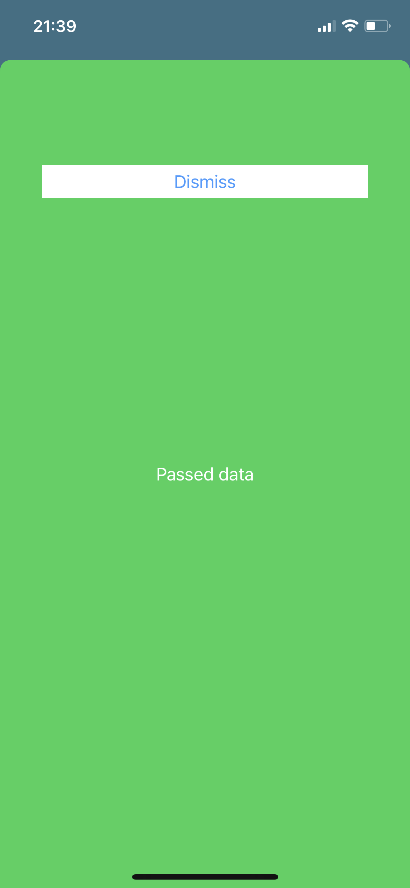

# PassingData
  

Probably the easiest way to pass data from one to another ViewController.
  

  

Passing string from one ViewController to the another, using present and dismiss. Setting label text property to the string in order to be presented in UI.

